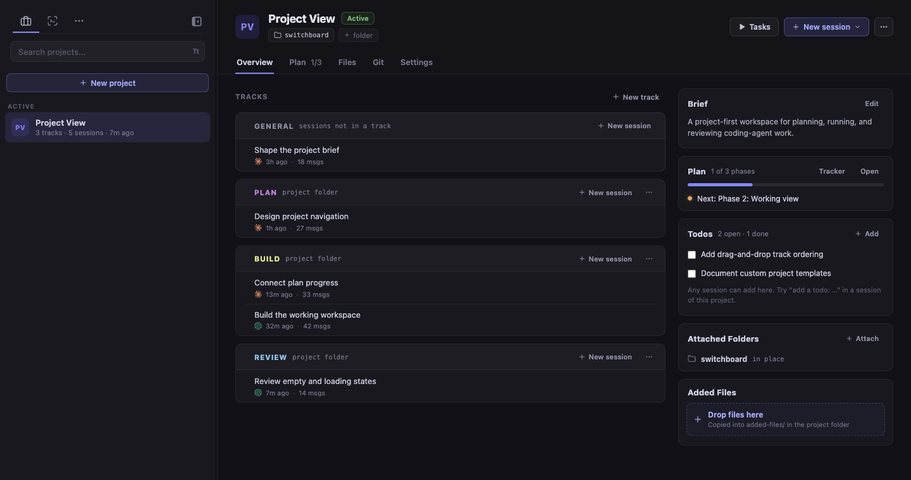
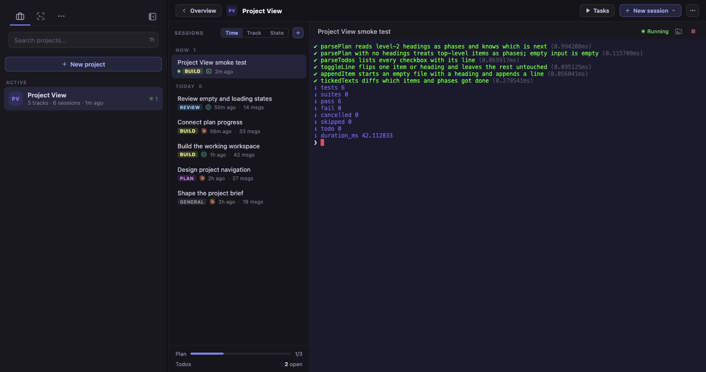
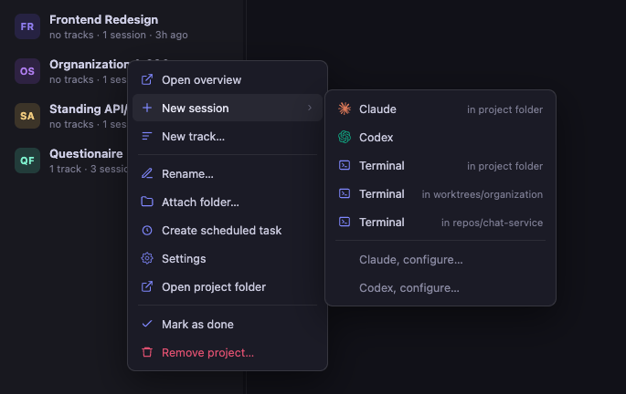
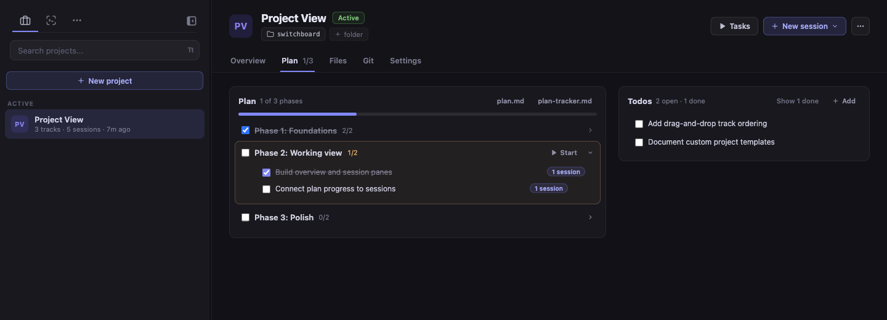

# Switchboard

Your command center for CLI coding sessions.

Switchboard is a desktop app that puts every Claude Code and Codex session, across every project, in one window. Launch, resume, fork, and monitor sessions without juggling terminal tabs or digging through `~/.claude/projects` and `~/.codex/sessions` for that one conversation from last week.


**[Download the latest release](https://github.com/doctly/switchboard/releases/latest)** · **[Join the Slack community](https://join.slack.com/t/switchboard-jg96485/shared_invite/zt-490s7hh3p-lktCuVxj2MIjRKUUj2hYWQ)**

## Contents

- [Install](#install)
- [Supported CLIs](#supported-clis)
- [Features at a glance](#features-at-a-glance)
- [Sessions](#sessions)
- [Projects](#projects)
- [Project Tasks and Server Logs](#project-tasks-and-server-logs)
- [Keyboard shortcuts](#keyboard-shortcuts)
- [Development](#development)
- [Further reading](#further-reading)

## Install

Grab the release for your platform from the [releases page](https://github.com/doctly/switchboard/releases/latest):

| Platform | Package |
|---|---|
| macOS | `.dmg` (Apple Silicon and Intel) |
| Windows | `.exe` installer |
| Linux | `.AppImage`, `.deb`, or `.pacman` (Arch/Manjaro) |

On Arch the package is named **`switchboard-doctly`**. The app is still called Switchboard everywhere you see it. Uninstall with `sudo pacman -R switchboard-doctly`.

Packaged builds check GitHub Releases for updates on launch and every 4 hours, download in the background, and show a toast when an update is ready. Restart to install immediately, or dismiss and it installs on next quit. To build from source instead, see [Development](#development).

## Supported CLIs

| | Claude Code (`claude`) | Codex (`codex`) |
|---|---|---|
| Browse and search history | ✅ | ✅ |
| Resume a session | ✅ | ✅ |
| Start a new session | ✅ | ✅ |
| Fork a session | ✅ | ✅ |
| Read in the message viewer | ✅ | ✅ |
| Status and activity indicators | ✅ | ✅ |
| Session names from `/rename` | ✅ | — |
| IDE emulation (diff review) | ✅ | — |
| Plans and memory files | ✅ | — |

Sessions from both CLIs share one sidebar, each row marked with its CLI's logo. A fork runs on the CLI that wrote the session being forked.

Turn either CLI off under **CLI Agents** in Settings. A switched-off CLI is not scanned, not watched, and not offered when you start a session, and its sessions are hidden. Its history is kept, so switching it back on restores everything immediately. At least one CLI always stays on.

## Features at a glance

- **Session browser** — Every session from every supported CLI, organized by folder, searchable by content.
- **Fork and resume** — Branch off from any point in a session's history.
- **Built-in terminal** — Connect to running sessions or launch new ones without leaving the app.
- **Status notifications** — In-app alerts when a session is waiting for permission approval or user input.
- **Session grid** — Live terminals for all open sessions on one screen.
- **Per-CLI launch options** — Permission mode, worktree, sandbox, approval policy, and model, set per session, per project, or globally.
- **IDE emulation** (Claude only) — Review and edit Claude's proposed diffs in a side panel before they land.
- **Projects** — Group work by what it is, not where it lives: a folder on disk, a brief the agent reads, a plan, a todo list, and the sessions filed under it.
- **Project tasks and server logs** — Run `.vscode/tasks.json` commands and keep their logs beside your sessions.
- **Plans and memory** (Claude only) — Browse and edit plan files and `CLAUDE.md` in one place.
- **Activity stats** — Heatmap of your coding activity across all projects.

## Sessions

The **Sessions** tab lists every session grouped by the folder it runs in. Full-text search finds a session by what was discussed, not just when it happened. Any session can be resumed, forked from any point in its history, or read in the message viewer.

### Launch options

Each CLI exposes its own options when you start or resume a session:

| CLI | Options |
|---|---|
| Claude Code | Permission mode, worktree, Chrome |
| Codex | Sandbox policy, approval policy, model |

Set them per session, per project, or globally in Settings.

### Status notifications

Switchboard watches every session in the background, Claude and Codex alike, and shows status in the sidebar so you can tell at a glance which sessions need attention while you work in a different one.


- **Waiting for input** — A session that needs your response is highlighted.
- **Permission approval** — A session blocked on a permission grant or approval gets a badge immediately. Switchboard reads each CLI's own wording, so Claude's permission prompts and Codex's approval requests both register.
- **Activity indicators** — See which sessions are running, idle, or finished.

### Session grid

Toggle the grid from the sidebar for a bird's-eye view of all open sessions, grouped by project.


- **Live terminals** — Every open session renders its full terminal in a card, whichever CLI it runs.
- **Status at a glance** — Each card shows a running/stopped/busy dot and last-activity time.
- **Click to focus, double-click to expand** — Click a card header to focus it. Double-click to return to the single-terminal view for that session.
- **Persistent** — The grid preference survives restarts.

### IDE emulation and file preview (Claude only)

Switchboard can act as an IDE for Claude Code. It speaks Claude CLI's own IDE protocol, so Codex sessions launch without it. When enabled, Claude's file opens and proposed edits appear in a side panel next to the terminal instead of going to an external editor.


- **Diff review** — A proposed change shows up as a diff. Accept or reject it in place.
- **Inline and side-by-side** — Toggle between unified and side-by-side views. The choice is remembered.
- **Partial acceptance** — In inline mode, accept or reject individual chunks, then submit the result.
- **File viewer** — Clickable file links in terminal output (OSC 8 hyperlinks) open in the side panel with syntax highlighting.

To let Claude use VS Code, Cursor, or another editor instead, uncheck **IDE Emulation** in **Global Settings**. Switchboard then stops registering as an IDE and Claude CLI discovers your real editor. The change applies to new sessions only.

## Projects

The Sessions tab groups sessions by the folder they run in. The **Projects** tab groups them by the work they belong to.

| | What it is |
|---|---|
| **Project** | A piece of work with a folder on disk. Everything else about it is optional. |
| **Track** | A line of effort inside a project, with its own sessions. Optional. |
| **Session** | A session as it is today, plus the project it belongs to. |
| **Folder** | What the Sessions tab shows: a path on disk. A project can attach any number. |



### The project folder and brief

Every project gets a real folder under `~/Switchboard/` (change it under **Projects Folder** in Global Settings). Switchboard writes a starter brief into `CLAUDE.md` and `AGENTS.md` there. The brief tells the agent where the project's files go, and the agent creates them when it first needs them:

| File | Purpose |
|---|---|
| `plan.md` | The plan, in whatever form fits the work |
| `plan-tracker.md` | Phases with checkboxes, so Switchboard can show progress |
| `todos.md` | Follow-ups and ideas |
| `memory.md` | Anything worth remembering across sessions |

None of these is read at the start of a session, only when the plan or the todos come up. The brief also lists the attached folders and tells the agent to read each folder's own instructions before changing files there. Attaching or detaching a folder updates that list. The rest of the brief is yours to edit.

### Where sessions start

Sessions start in the project folder by default. A project or a track can choose an attached folder instead. Wherever a project session starts, Switchboard passes the project folder and every attached folder to the CLI as extra directories, so the agent can read and edit all of them.

The two CLIs handle this differently:

- **Claude** loads the `CLAUDE.md` from each of those directories.
- **Codex** only reads `AGENTS.md` from the folder it starts in, so a Codex session that starts in an attached folder does not see the project brief. Codex also refuses extra directories unless its sandbox is `workspace-write` or `danger-full-access`, so Switchboard's global default for Codex is `workspace-write`. Choose "Default" in Settings to hand the choice back to Codex's own config. Under `read-only` the extra directories are left off, since read-only can read every path anyway.

### Overview and working mode

The Projects tab lists projects only. Selecting one opens its **Overview**: the brief, the plan's progress, open todos, attached folders, and one card per track with its latest sessions.

Opening a session from there switches to working mode: a slim project strip on top, a session list beside the terminal, and the plan and todo counts at the foot of the list.



- **Grouping** — Group the list by **Time** (today, yesterday, this week...), **Track**, or **State** (needs input, running, idle).
- **Rows** — Each row shows the title, the track, the CLI, its age, and message count. Right-click a project, track, or session for its actions.
- **Ordering** — Projects and sessions are ordered by their last event: a new session started, a turn finished, or the CLI asked for something. Opening or resuming a session does not move it, so the list holds still under a click. A session that is still working does not move while its transcript grows, so two working sessions hold their places instead of leapfrogging.
- **Archived** — Archived sessions sit in a closed "Archived" line at the foot of the list and under each track card. One click opens them, dimmed, in place.

The project's **Settings** tab is a list of rows: the name, the start folder, folders, the worktree branch, and the tracks. Changes save as you make them. Folder rows show the branch each folder is on, read from git when the page opens, and "modified" when there are uncommitted changes.

### Creating and organizing projects



- **New project** — Name it, pick a template, and attach the folders it works in. The dialog shows what Create will make: the project folder and its files, each worktree on its branch, and the tracks the template adds. Sessions started from the overview are filed under the project and still show under their folder in the Sessions tab.
- **Tracks** — Optional lines of work inside a project, each with its own sessions, start folder, and CLI. A track card's "Resume latest" reopens its most recent session. "New" starts one there.
- **Move to project** — Any session row has a move action. Nothing is filed until you launch it from a project or move it there.
- **Mark as done** — Done projects drop to the bottom, collapsed. Removing a project only forgets it. The folder and the sessions stay on disk.

### Plan tab



The Plan tab shows the phases in `plan-tracker.md` with their items, the todos, and which sessions started or finished each one. Tick items in place, or start a session on a phase or a todo: it opens with that item as its first prompt, filed under the project. A plan written in Claude Code's plan mode can be adopted into a project from the Plans list.

### Worktrees

Attaching a plain folder uses it where it is. Attaching a git repository asks how the project should work in it:

- **As it is**, on whatever branch is checked out.
- **With its own checkout** under the project folder at `repos/<name>`, on one branch shared by every worktree in the project, or one you name per repository.

A worktree inherits the repository's `.vscode/tasks.json`. For Codex, Switchboard writes an `AGENTS.override.md` into the worktree carrying the project brief and the repository's own `AGENTS.md`, excluded from git. Marking a project done offers to remove its worktrees. Branches stay.

## Project Tasks and Server Logs

Switchboard runs the commands in a project's `.vscode/tasks.json` without needing a debugger. Use it for dev servers, workers, asset watchers, test suites, or any long-running command whose output you want next to your coding sessions.

- **Task launcher** — A play button appears in each project header. In worktree headers it sits between the hide and new-session buttons on hover, and stays visible while a task runs. A project's menu combines the tasks from every attached folder.
- **Live, retained logs** — Running a task keeps the menu open and shows its state on the row. Clicking a task that has run opens its terminal in the main pane, or beside the session list inside a project. Output is kept when you switch away, and the selected task view is restored after a renderer reload.
- **Independent lifecycle** — Tasks run separately from Claude and Codex sessions. Stop or restart them from the terminal header without touching an agent transcript.
- **Project and worktree scope** — Commands run with the selected project or worktree as `${workspaceFolder}`. A worktree inherits its parent project's tasks when it has no `.vscode/tasks.json` of its own. A worktree-local file overrides the inherited one.
- **Compound stacks** — `dependsOn` tasks start several services in parallel, so one click can bring up API + worker + frontend. Stopping the compound stops its children.

Example:

```jsonc
{
  "version": "2.0.0",
  "tasks": [
    {
      "label": "API server",
      "type": "process",
      "command": "${workspaceFolder}/.venv/bin/python",
      "args": ["-m", "uvicorn", "app.main:app", "--reload"],
      "options": { "cwd": "${workspaceFolder}" },
      "isBackground": true
    },
    {
      "label": "Frontend",
      "type": "npm",
      "script": "dev",
      "isBackground": true
    },
    {
      "label": "Full stack",
      "dependsOn": ["API server", "Frontend"],
      "dependsOrder": "parallel"
    }
  ]
}
```

**Supported:** JSON with comments and trailing commas; `shell`, `process`, and `npm` tasks; `dependsOn` and `dependsOrder`; task working directories and environment variables; platform overrides; an optional `options.envFile`; and the common workspace, home, path-separator, and `${env:NAME}` variables.

**Out of scope:** debug adapters, breakpoints, VS Code command and input variables, and problem-matcher diagnostics. The feature is deliberately focused on running commands and seeing their logs.

## Keyboard shortcuts

| Shortcut | Action |
|---|---|
| `Cmd+F` / `Ctrl+F` | Find in file (also works in the terminal) |
| `Cmd+G` / `Ctrl+G` | Go to line |

## Development

### Prerequisites

- **Node.js** 20+
- **npm** 10+
- Build tools for native modules (node-pty, better-sqlite3):
  - **macOS**: Xcode Command Line Tools (`xcode-select --install`)
  - **Linux**: `build-essential` and `python3` (`sudo apt install build-essential python3`)
  - **Windows**: Visual Studio Build Tools or `npm install -g windows-build-tools`

### Running from source

```bash
npm install      # installs dependencies and runs postinstall
npm start        # bundles CodeMirror, then launches Electron
```

After the first run, skip the bundle step for faster iteration:

```bash
npm run electron
```

To keep a development instance's data separate from the installed app, set `SWITCHBOARD_DATA_DIR`:

```bash
npm run electron-dev    # uses ~/.switchboard-dev
```

Run the test suite with:

```bash
npm test
```

### Building

Every build command bundles CodeMirror first, then runs electron-builder. Output goes to `dist/`.

```bash
npm run build           # current platform
npm run build:mac       # DMG + zip (arm64 + x64)
npm run build:win       # NSIS installer (x64 + arm64)
npm run build:linux     # AppImage + deb + pacman (x64 + arm64)
```

**Arch / Manjaro:** the `deb` and `pacman` targets use the `fpm` binary bundled with electron-builder, which links against `libcrypt.so.1`. Arch ships `libxcrypt` without that legacy ABI, so install the compat shim once. `AppImage` builds without it.

```bash
sudo pacman -S libxcrypt-compat
```

### Code signing

Set these environment variables for signed distribution builds:

| Platform | Variables |
|---|---|
| macOS | `CSC_LINK` (p12 certificate) and `CSC_KEY_PASSWORD`, or sign via Keychain |
| Windows | `CSC_LINK` and `CSC_KEY_PASSWORD` for EV/OV code signing |
| Any | `CSC_IDENTITY_AUTO_DISCOVERY=false` to skip signing (CI artifact builds) |

The macOS build uses custom entitlements in `build/entitlements.mac.plist` to allow JIT and unsigned memory execution, which the native modules require.

### Releasing

Releases are driven by git tags. The GitHub Actions workflow builds for all platforms and publishes to GitHub Releases:

```bash
git tag v0.1.0
git push origin v0.1.0
```

To release locally instead, set `GH_TOKEN` to a GitHub personal access token with `repo` scope and run:

```bash
npm run release
```

### Project structure

```
main.js            Electron main process
preload.js         Context bridge (IPC bindings)
db.js              SQLite session cache and metadata
harnesses/         Per-CLI modules (claude, codex) and registry
public/            Renderer (HTML/CSS/JS)
templates/         Built-in project templates (feature, research, customer)
workers/           Background workers
scripts/           Build and postinstall scripts
test/              Node test suite (npm test)
build/             Icons, entitlements, screenshots, builder resources
.github/workflows/ CI/CD
```

## Further reading

- [`docs/customizing-colors.md`](docs/customizing-colors.md) — changing the app's colors and applying a light theme (in French).

## License

MIT. See [LICENSE](LICENSE).
