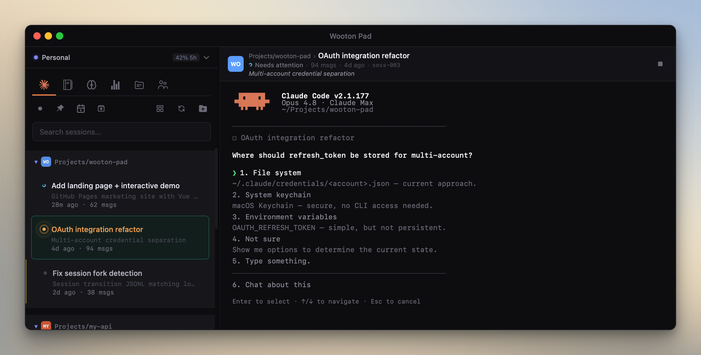

# Wooton Pad

> **Fork of [Switchboard](https://github.com/doctly/switchboard)** — extended with multi-account support, git integration, and a project viewer panel.

---

**[fortael.github.io/switchboard](https://fortael.github.io/switchboard/)** — Your command center for Claude Code sessions.

---

Wooton Pad is a desktop app that gives you a unified view of all your Claude Code sessions across every project. Launch, resume, fork, and monitor sessions from a single window — no more juggling terminal tabs or digging through `~/.claude/projects` to find that one conversation from last week.



### Key Features

- **Session Browser** — All your Claude Code sessions, organized by project, searchable by content
- **Built-in Terminal** — Connect to running sessions or launch new ones without leaving the app
- **Status Notifications** — In-app alerts when a session is waiting for permission approval or user input
- **Fork & Resume** — Branch off from any point in a session's history
- **Full-Text Search** — Find any session by what was discussed, not just when it happened
- **IDE Emulation** — Acts as an IDE for Claude CLI, showing file diffs and opens in a side panel where you can accept, reject, or edit changes before they're applied. Supports both inline and side-by-side diff views. Disable this in Global Settings if you prefer Claude to use your own editor (VS Code, Cursor, etc.)
- **Plans & Memory** — Browse and edit your plan files and CLAUDE.md memory in one place
- **Activity Stats** — Heatmap of your coding activity across all projects
- **Session Names** — Picks up session names from Claude Code's `/rename` command automatically

## Installation

### Download

Grab the latest macOS build (Apple Silicon) from the releases page:

**[Download Wooton Pad](https://github.com/fortael/switchboard/releases/latest)**

#### macOS security warning

Because Wooton Pad is not code-signed with an Apple Developer certificate, macOS will block it on first launch with a "damaged" message. Remove the quarantine attribute after installing:

```bash
xattr -cr "/Applications/Wooton Pad.app"
```

Then open the app normally.

### Build from source

```bash
git clone https://github.com/fortael/switchboard.git
cd switchboard
npm install
npm start        # run in dev mode
npm run build    # build a distributable for your platform
```

See **[docs/building.md](docs/building.md)** for full build instructions and prerequisites.

## Session Grid Overview

Toggle the grid overview from the sidebar for a bird's-eye view of all your open sessions at once, grouped by project.


- **Live terminals** — Every open session renders its full terminal in a card, so you can monitor multiple Claude agents simultaneously.
- **Status at a glance** — Each card shows a running/stopped/busy indicator dot and last-activity timestamp.
- **Click to focus, double-click to expand** — Click a card header to focus it; double-click to switch back to single-terminal view for that session.
- **Persistent** — Grid preference is saved across restarts.

## File Preview Side Panel & Claude IDE MCP Emulator

Wooton Pad can act as an IDE for your Claude Code sessions. When enabled, Claude's file opens and proposed edits appear in a side panel next to the terminal instead of being sent to an external editor.


- **Diff review** — When Claude proposes a file change, it shows up as a diff in the side panel. You can review the changes and accept or reject them directly.
- **Inline & side-by-side** — Toggle between inline (unified) and side-by-side diff views. Your preference is remembered across sessions.
- **Partial acceptance** — In inline mode, you can accept or reject individual chunks within a diff, then submit the final result.
- **File viewer** — Clickable file links in terminal output (OSC 8 hyperlinks) open in the side panel with syntax highlighting.

To disable IDE emulation entirely (e.g. if you want Claude to use VS Code or Cursor instead), uncheck **IDE Emulation** in **Global Settings**. This stops Wooton Pad from registering as an IDE, so Claude CLI will discover and connect to your real editor. Changes take effect on new sessions — running sessions are not affected.

## Status Notifications

Wooton Pad monitors all your sessions in the background and shows status indicators in the sidebar so you can tell at a glance which sessions need attention — even when you're working in a different one.


- **Waiting for input** — A session that needs your response is highlighted so you don't miss it.
- **Permission approval** — When Claude is blocked waiting for a permission grant, the session badge lets you know immediately.
- **Activity indicators** — See which sessions are actively running, idle, or finished.

## Editor

| Shortcut | Action |
|----------|--------|
| `Cmd+F` / `Ctrl+F` | Find in file (also works in terminal) |
| `Cmd+G` / `Ctrl+G` | Go to line |

## Development Setup

**Prerequisites:** Node.js 20+, npm 10+, and platform build tools for native modules:
- **macOS**: Xcode Command Line Tools (`xcode-select --install`)
- **Linux**: `build-essential`, `python3` (`sudo apt install build-essential python3`)
- **Windows**: Visual Studio Build Tools or `npm install -g windows-build-tools`

```bash
npm install
npm start
```

`npm start` bundles CodeMirror and launches Electron. For faster iteration after the first run:

```bash
npm run electron
```

## Building

```bash
npm run build:mac     # DMG (arm64)
npm run build:win     # NSIS installer (x64 + arm64)
npm run build:linux   # AppImage + deb (x64 + arm64)
```

Output goes to `dist/`.

## Releasing

Create the GitHub Release manually via the web interface, then push the matching tag:

```bash
git tag v0.2.0
git push origin v0.2.0
```

The GitHub Actions workflow builds the macOS DMG and uploads it to the existing release.

## Auto-Updates

The app checks for updates from GitHub Releases on launch and every 4 hours. A status indicator in the toolbar shows when a new version is available.

## Project Structure

```
main.js            Electron main process
preload.js         Context bridge (IPC bindings)
db.js              SQLite session cache & metadata
public/            Renderer (HTML/CSS/JS)
scripts/           Build & postinstall scripts
build/             Icons, entitlements, builder resources
.github/workflows/ CI/CD
```
